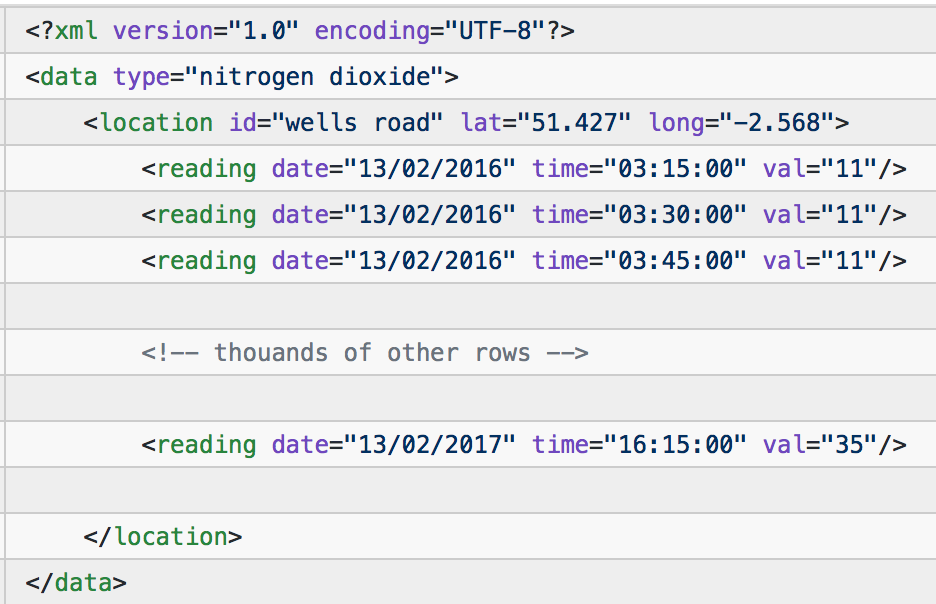
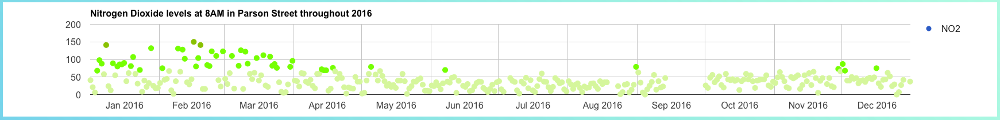
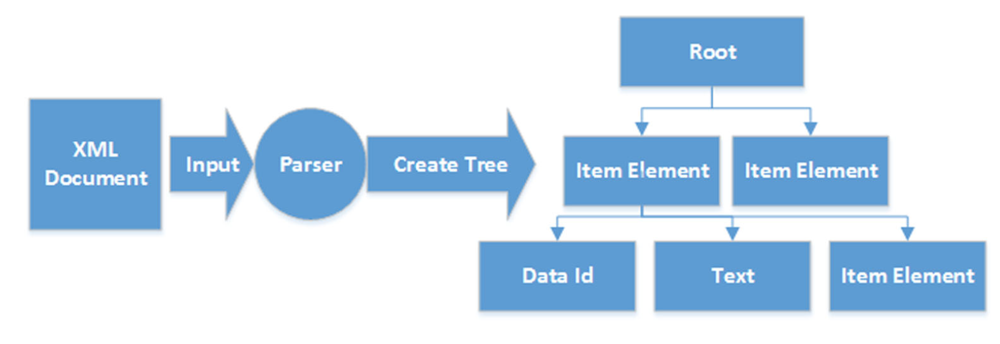
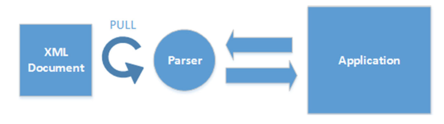
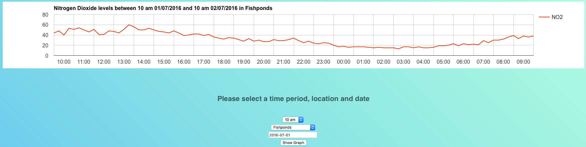
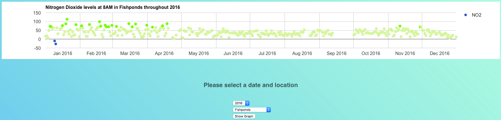

# Visualising Nitrogen Dioxide Levels in Bristol
### By Max Nethercott, 15005627

#### Links to XML, HTML and PHP source code:

| Item          | Link          |
| ------------- |:-------------:|
| Graph 1 visualisation | [link](http://www.cems.uwe.ac.uk/~m2-nethercott/UFCFR5-15-3-hand-in/Tasks/Task%202/Chart%201/scatterChart.html) |
| Graph 2 visualisation  | [link](http://www.cems.uwe.ac.uk/~m2-nethercott/UFCFR5-15-3-hand-in/Tasks/Task%202/Chart%202/lineChart.html)   |
|Task 1 on UWE server   | [link](http://www.cems.uwe.ac.uk/~m2-nethercott/UFCFR5-15-3-hand-in/Tasks/Task%201/)  |


### Introduction

This report will explain the process of using real life data to visualise Nitrogen Dioxide levels at six locations throughout Bristol. The use of XML document parsers and the Google Charts API will be reviewed in detail as they were of great importance.

The process consisted of **Three** main parts:

1. Normalise & Optimise the data given using streaming parsers.
2. Visualisation using Google Charts API
3. Refactoring & Reflection

A php script was used to pull the data from a csv file to create the initial XML. However, this contained repeated data and was much too large and difficult to process. Therefore, using a Divide & Conquer Strategy, the file was broken up into smaller more optimised data chunks. These were much easier and quicker to process

This created **six** further XML files, in the following format, for the six stations:


<p align="center">
  
</p>
<p align="center">
**Figure 1** *Example format of final XML.*
</p>
This data would then be visualised in a suitable way using the Google Charts API:


<p align="center">

</p>

**Figure 2** *Example of Chart made using Google Chart API.*

### Streaming parsers Vs DOM parsers for document processing


As XML becomes widespread, it is critical for application developers to understand the operational and performance characteristics of XML processing, as highlighted by Ding and Liu (2008).

Firstly, a DOM parser creates a tree structure in memory in which the document, elements and attributes are all structured as tree nodes. Each node is an object that contains values and methods used for navigation, data access, modification and other operations as explained by Wang,Li and Homayounfar (2007). Therefore, the DOM stores the entire structure of the XML into memory and calls the memory block via call procedures (Liou and Chen, 2014). Once in memory, DOM trees can be navigated freely and parsed arbitrarily, and hence provide maximum flexibility for developers.

The size of a DOM tree created from an XML document may be as large as 10 times the size of the original document (Wang,Li and Homayounfar,2007). In worse case scenarios the DOM parser cannot handle a document at all because of its size. Furthermore, DOM  can access data only after parsing is complete, hence a large document will significantly delay data access. Moreover, the model’s long-lived data representations make memory usage grow with document size, which is undesirable for streaming as explained by Liou and Chen (2014). This may not be an issue when working with small documents, however the documents used in this work were large, and hence a streaming parser was used.

<p align="center">


</p>

**Figure 3** *Liou and Chen (2014) highlighting the XML processing operational flow for the DOM parser.*


A php ```XMLReader()``` was used, this is a type of ‘pull parser’. A pull parser uses an iterator pattern to progressively access the XML document and encode them  sequentially (Liou and Chen, 2014). Streaming requires low latency and memory usage, and usually the parser only needs to extract a small portion of the document sequentially without knowing the entire document structure. This is exactly what was needed when processing the initial XML documents in this work. Moreover, stream-based parsers can start generating output immediately, and infoset elements can be discarded and garbage collected immediately after they are used.

However, the primary trade-off with stream processing is that you can only see the infoset state at one location at a time in the document. You are essentially limited to the “cardboard tube” view of a document, the implication being that you need to know what processing you want to do before reading the XML document.

<p align="center">


</p>

**Figure 4** *Liou and Chen (2014) highlighting the XML processing operational flow for the PULL parser.*

### Charting and Data Visualisation

Google Charts, a powerful, simple to use, and free API was used to implement the visualisation of the Nitrogen Dioxide levels throughout Bristol.

**Example of Final Graphs:**

<p align="center">


</p>

<p align="center">


</p>


Chart 1 was extended by adding colour to the plots to represent the severity of the nitrogen dioxide level at a given time. An extra column was added to the JSON that had the role of style, and was of type string. A function was created that would obtain the NO2 value of a given plot and return a string to be put into the JSON for google charts to process and thus produce a colour coding of each plot.

Asynchronous JavaScript and XML was used to send and retrieve the required information to and from a PHP script and thus use it to create both graphs 1 and 2.

To capture the user, input HTML forms were used with the ```onchange``` event attribute, which then calls a javascript method containing the AJAX call. jQuery ```serialize()``` method was incorporated in the AJAX call. This creates a URL encoded text string by serialising form values. The serialised values can be used in the URL query string when making an AJAX request.


### References

- Ding, T. and Liu, J.C. (2008) XML Document Parsing: Operational and Performance Characteristics. IEEE Computer Society. 41 (9), pp. 30-37.

- Liou, Y.Z. and Chen, H.M. (2014) Performance evaluation of continuity of care records (ccrs): parsing models in a mobile health management system. Journal of Medical Systems. 38 (10), pp. 1-19.

- Wang, F., Li, J.C. and Homayounfar, H. (2007) A space efficient XML DOM parser. Data & Knowledge Engineering. 60 (1), pp. 185-207.

- Why StAX?, docs.oracle.com, Available from: https://docs.oracle.com/javase/tutorial/jaxp/stax/why.html [Accessed 07 March 2018].
